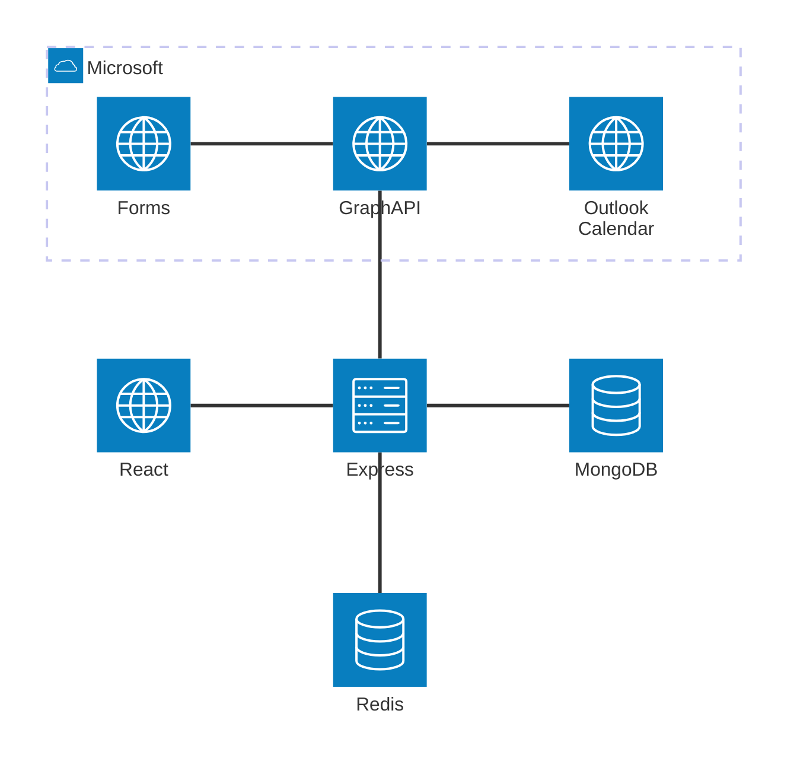

# Infopiste

[](https://github.com/Infopisteprojekti/infopiste/actions/workflows/front.yaml)
[](https://github.com/Infopisteprojekti/infopiste/actions/workflows/back.yaml)

Application in development with the goal of showing useful information relevant to Exactum on an info screen.

Staging in <https://infopiste-ohtuprojekti-staging.ext.ocp-test-0.k8s.it.helsinki.fi/>

## Running locally

Clone the repository and install docker to get started.

Install dependencies before running the project for the first time with command `npm i`.

Create a `.env` file inside the project's root directory. In that file, copy the contents of the `.sample.env` and add the correct values for the variables.

> [!CAUTION]  
> Do not put API-keys in `.sample.env`!

Start the full application in development mode:

```bash
$ npm run dev
# or
$ docker compose -f docker-compose.dev.yaml up -d
```

The application in development mode can be accessed from `http://localhost:5173`.

The application can be shut down with command:

```bash
$ docker compose down
# or
$ docker compose down -v # Also deletes MongoDB data
```

To run tests use the command:

```bash
$ npm test
```

To lint backend and frontend use the command:

```bash
$ npm run lint
# or
$ npm run lint:fix # Lint and auto-fix
```

You can also start the application in production mode with command:

```bash
$ npm start
# or
$ docker compose up
# or
$ npm run reset # Rebuild the production docker images
```

The application in production mode can be accessed from `http://localhost:5173`.

## Documentation

### Application architecture



### Topics

- [Backlog](https://github.com/Infopisteprojekti/infopiste/projects?query=is%3Aopen)

- [Frontend documentation](documentation/frontend.md)

- [Backend documentation](documentation/backend.md)

- [CI/CD description](documentation/deployment.md)
